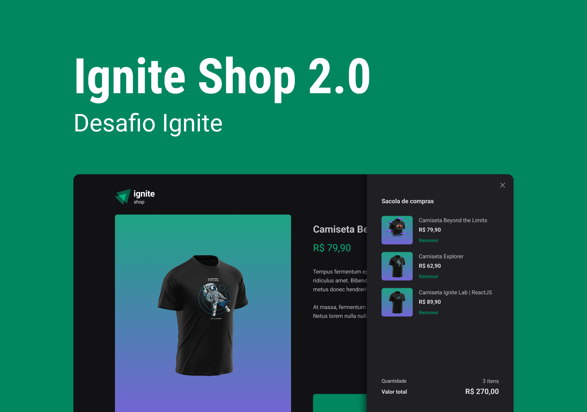

<h1 align="center"> Ignite Shop 2.0 </h1>

  <a href="#-tecnologias">Tecnologias</a>&nbsp;&nbsp;&nbsp;|&nbsp;&nbsp;&nbsp;
  <a href="#-projeto">Projeto</a>&nbsp;&nbsp;&nbsp;|&nbsp;&nbsp;&nbsp;
  <a href="#-layout">Layout</a>&nbsp;&nbsp;&nbsp;|&nbsp;&nbsp;&nbsp;
  <a href="#memo-licença">Licença</a>

  

 

  

## 🚀 Tecnologias

Esse projeto foi desenvolvido com as seguintes tecnologias:

- Vite
- ReactJS
- HTML e CSS
- TypeScript
- Git e Github
- Figma

## 💻 Projeto

O Ignite Shop 2.0 é um aplicação web de vendas de camisetas com temas do mundo dev.

## 🔖 Layout

Você pode visualizar o layout do projeto através [DESSE LINK](https://www.figma.com/file/8Ul5yeqw2mz2SfUTbnCQAD/Ignite-Shop-2.0-Copy?fuid=1121438917512205675). É necessário ter conta no [Figma](https://figma.com) para acessá-lo.